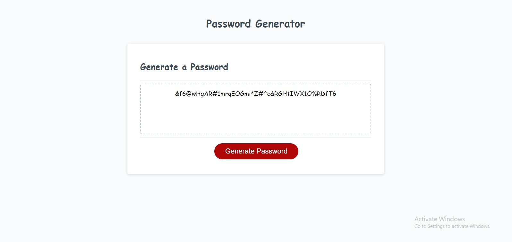

First Ever Password Generator

DESCRIPTION

I updated the script.js file to make a working password generator. I had to make a bunch of variables that were used for the characters in the password. I then created variables that I used to make my prompts that were used to select what type of characters were going to be used for the generated password. Finaly i made a for loop that randomized a bunch of characters that were used to build the final password.

https://github.com/MartinezN2014/FirstEverPasswordGenerator

https://martinezn2014.github.io./FirstEverPasswordGenerator/

